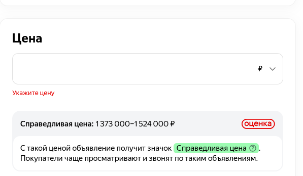
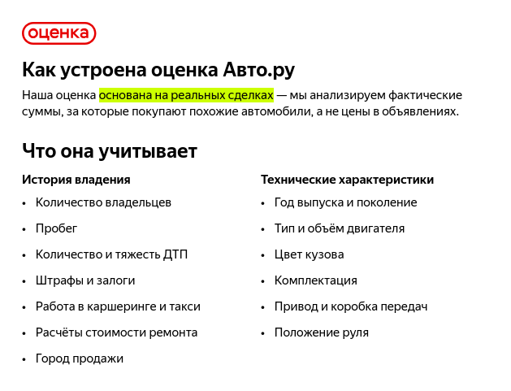

#  
PROJECT final. Predict price used cars for auto.ru
 

##   Содержание 

[1. Введение](https://github.com/DmitVasilev/Project_final_auto_ru?tab=readme-ov-file#-1-%D0%B2%D0%B2%D0%B5%D0%B4%D0%B5%D0%BD%D0%B8%D0%B5-)   
[2. Описание задачи](https://github.com/DmitVasilev/Project_final_auto_ru?tab=readme-ov-file#2-%D0%BE%D0%BF%D0%B8%D1%81%D0%B0%D0%BD%D0%B8%D0%B5-%D0%B7%D0%B0%D0%B4%D0%B0%D1%87%D0%B8)   
[3. Описание данных](https://github.com/DmitVasilev/Project_final_auto_ru?tab=readme-ov-file#3-%D0%BE%D0%BF%D0%B8%D1%81%D0%B0%D0%BD%D0%B8%D0%B5-%D0%B4%D0%B0%D0%BD%D0%BD%D1%8B%D1%85)   
[4. Результат](https://github.com/DmitVasilev/Project_final_auto_ru?tab=readme-ov-file#4-%D1%80%D0%B5%D0%B7%D1%83%D0%BB%D1%8C%D1%82%D0%B0%D1%82)                  
[5. Выводы](https://github.com/DmitVasilev/Project_final_auto_ru?tab=readme-ov-file#5-%D0%B2%D1%8B%D0%B2%D0%BE%D0%B4%D1%8B)                                        
[6. Контакты](https://github.com/DmitVasilev/Project_final_auto_ru?tab=readme-ov-file#6-%D0%BA%D0%BE%D0%BD%D1%82%D0%B0%D0%BA%D1%82%D1%8B)

###  1. Введение 

В данном проекте решается задача регрессии по прогнозу цен на подержанные автомобили с сайта auto.ru. Многие агрегаторы объявлений, включая  auto.ru, уже предлагают при заполнении объявлений рекомендацию по назначению цены товара.
Как это происходит.
 При подаче объявления на сайт клиент заполняет анкету содержащую сведенья об автомобиле. На основании этой анкеты ему предлагается диапазон значений прогноза цены.
 

Данный сервис, по утверждению сайта, использует фактические цены, за которые автомобили были куплены, данные из анкеты, а также расчет стоимости ремонта, количество и тяжесть ДТП.

Доступа к информации о фактической цене продажи автомобиля у нас нет, как и к истории автомобиля (в объявлении предлагается купить эту информацию за отдельную плату). 
Попробуем реализовать похожий сервис для объявлений по продаже подержанных автомобилей на сайте auto.ru используя информацию из объявлений на сайте auto.ru.  

:arrow_up:[к содержанию](https://github.com/DmitVasilev/Project_final_auto_ru/tree/8dac52cc89221d558fc73aaab45162d2f15baa41#-%D1%81%D0%BE%D0%B4%D0%B5%D1%80%D0%B6%D0%B0%D0%BD%D0%B8%D0%B5-) 

###  2. Описание задачи

**Бизнес-задача:** необходимо реализовать сервис по прогнозированию цены на поддержанные автомобили основываясь на данных указанных в объявлении.

**Техническая задача:** необходимо провести сбор доступной в объявлениях информации. Собрать из полученных данных датасет. Провести обработку и исследовательский анализ данных. Построить модели машинного обучения. Провести настройку гиперпараметров моделей и выбрать модель с лучшим показателем метрики средней абсолютной процентной ошибки. Подготовить модель к внедрению в продакшен.

**Основные цели проекта:**
1. Произвести сбор данных из объявлений на сайте auto.ru.
2. Провести сборку и предобработку набора данных.
3. Провести разведывательный анализ данных и выявить основные закономерности.
4. Построить несколько моделей машинного обучения, решающих задачу регрессии - прогноз цены подержанного автомобиля. Провести настройку гиперпараметров и выбрать лучшую модель.
5. Подготовить модель к внедрению в продакшен. 

:arrow_up:[к содержанию](https://github.com/DmitVasilev/Project_final_auto_ru/tree/8dac52cc89221d558fc73aaab45162d2f15baa41#-%D1%81%D0%BE%D0%B4%D0%B5%D1%80%D0%B6%D0%B0%D0%BD%D0%B8%D0%B5-) 

###  3. Описание данных

В проекте используется собственный датасет, собранный на основе информации из объявлений о продаже подержанных автомобилей на сайте auto.ru. В нем содержатся данные объявлений о продажах более 35 тысяч автомобилей за 3 квартал 2024г. Итоговый датасет содержит 197 признаков. Описание признаков приведено в отдельном файле [features.md](https://github.com/DmitVasilev/Project_final_auto_ru/blob/8dac52cc89221d558fc73aaab45162d2f15baa41/features.md).
              
:arrow_up:[к содержанию](https://github.com/DmitVasilev/Project_final_auto_ru/tree/8dac52cc89221d558fc73aaab45162d2f15baa41#-%D1%81%D0%BE%D0%B4%D0%B5%D1%80%D0%B6%D0%B0%D0%BD%D0%B8%D0%B5-)                     

###  4. Результат

1. Сбор данных проводился с помощью модуля Selenium в два этапа:
   + на первом этапе собирались ссылки на описание автомобиля из карточек объявлений. Реализация парсера приведена в ноутбуке : [1_Auto_link_parser.ipynb](https://github.com/DmitVasilev/Project_final_auto_ru/blob/8dac52cc89221d558fc73aaab45162d2f15baa41/1_Auto_link_parser.ipynb);
   + на втором этапе проводился сбор подробной информации по ссылкам полученным на первом этапе. Реализация парсера приведена в ноутбуке : [2_Auto_parser.ipynb](https://github.com/DmitVasilev/Project_final_auto_ru/blob/8dac52cc89221d558fc73aaab45162d2f15baa41/2_Auto_parser.ipynb).     

2. Формирование признаков, предобработка данных и сборка датасета приведена в ноутбуке [3_Construct_data.ipynb](https://github.com/DmitVasilev/Project_final_auto_ru/blob/8dac52cc89221d558fc73aaab45162d2f15baa41/3_Construct_data.ipynb).

3. Разведывательный анализ данных приведен в ноутбуке [4_EDA.ipynb](https://github.com/DmitVasilev/Project_final_auto_ru/blob/8dac52cc89221d558fc73aaab45162d2f15baa41/4_EDA.ipynb).                
Для отображения интерактивных графиков можно воспользоваться nbviewer [4_EDA_nbviewer.ipynb](https://nbviewer.org/github/DmitVasilev/Project_final_auto_ru/blob/3668d283b13efeb8c64800cd55903ce774049f6d/4_EDA.ipynb) (Сервис nbviewer по видимому стал очень популярен и иногда превышает лимит запросов к API GitHub, выдавая ошибку. В этом случае можно подождать до начала следующего часа и попробовать снова)

4. Удаление выбросов, кодирование признаков, построение базовой модели, выбор наиболее значимых признаков, реализация более сложных моделей, подбор гиперпараметров, выбор лучшей модели и формирование пайплайна приведены в ноутбуке [5_Modeling.ipynb](https://github.com/DmitVasilev/Project_final_auto_ru/blob/8dac52cc89221d558fc73aaab45162d2f15baa41/5_Modeling.ipynb). Результаты экспериментов по подбору гиперпараметров моделей приведены в папке [optuna_exp](https://github.com/DmitVasilev/Project_final_auto_ru/tree/8dac52cc89221d558fc73aaab45162d2f15baa41/data/optuna_exp).

5. Подговка модели к продакшену приведена в папке [6_Production](https://github.com/DmitVasilev/Project_final_auto_ru/tree/8dac52cc89221d558fc73aaab45162d2f15baa41/6_Production). 
Подготовлено две реализации с использованием фреймворка Flask: 
   + через серверное и клиентское приложение;
   + через web страницу.
  
  Результаты приведены в папке [6.1_flask](https://github.com/DmitVasilev/Project_final_auto_ru/tree/8dac52cc89221d558fc73aaab45162d2f15baa41/6_Production/6.1_flask). Инструкция по запуску приведена в файле [Instructions.md](https://github.com/DmitVasilev/Project_final_auto_ru/blob/8dac52cc89221d558fc73aaab45162d2f15baa41/6_Production/6.1_flask/Instructions.md#%D0%B8%D0%BD%D1%81%D1%82%D1%80%D1%83%D0%BA%D1%86%D0%B8%D1%8F-%D0%BF%D0%BE-%D0%B7%D0%B0%D0%BF%D1%83%D1%81%D0%BA%D1%83-%D1%81%D0%B5%D1%80%D0%B2%D0%B8%D1%81%D0%BE%D0%B2-%D1%80%D0%B5%D0%B0%D0%BB%D0%B8%D0%B7%D0%BE%D0%B2%D0%B0%D0%BD%D0%BD%D1%8B%D1%85-%D1%81-%D0%BF%D0%BE%D0%BC%D0%BE%D1%89%D1%8C%D1%8E-flask).

  Также реализована микросервисная архитектура с использованием контейнеризации Docker и взаимодейсмтвия через брокер очередей RabbitMQ.                     
  Структура данных для сборки и запуска контейнеров приведена в папке [6.2_microservice_p](https://github.com/DmitVasilev/Project_final_auto_ru/tree/8dac52cc89221d558fc73aaab45162d2f15baa41/6_Production/6.2_microservice_p). Инструкция по запуску приведена в файле [Instructions.md](https://github.com/DmitVasilev/Project_final_auto_ru/blob/8dac52cc89221d558fc73aaab45162d2f15baa41/6_Production/6.2_microservice_p/Instructions.md#%D0%B8%D0%BD%D1%81%D1%82%D1%80%D1%83%D0%BA%D1%86%D0%B8%D1%8F-%D0%BF%D0%BE-%D1%81%D0%B1%D0%BE%D1%80%D0%BA%D0%B5-%D0%B8-%D0%B7%D0%B0%D0%BF%D1%83%D1%81%D0%BA%D1%83-%D0%BC%D0%B8%D0%BA%D1%80%D0%BE%D1%81%D0%B5%D1%80%D0%B2%D0%B8%D1%81%D0%BE%D0%B2-%D1%81-%D0%BF%D0%BE%D0%BC%D0%BE%D1%89%D1%8C%D1%8E--docker-compose).

  Чтобы не собирать контейнеры можно воспользоваться альтернативным вариантом приведенным в папке  [6.3_for_test_docker](https://github.com/DmitVasilev/Project_final_auto_ru/tree/8dac52cc89221d558fc73aaab45162d2f15baa41/6_Production/6.3_for_test_docker).В ней приведен модифицированный файл docker compose? в котором команды сборки заменены на команды загрузки образов из репозитария Docker Hub. Инструкция по запуску приведена в файле [Instructions.md](https://github.com/DmitVasilev/Project_final_auto_ru/blob/8dac52cc89221d558fc73aaab45162d2f15baa41/6_Production/6.3_for_test_docker/Instructions.md#%D0%B8%D0%BD%D1%81%D1%82%D1%80%D1%83%D0%BA%D1%86%D0%B8%D1%8F-%D0%BF%D0%BE-%D0%B7%D0%B0%D0%BF%D1%83%D1%81%D0%BA%D1%83-%D0%BC%D0%B8%D0%BA%D1%80%D0%BE%D1%81%D0%B5%D1%80%D0%B2%D0%B8%D1%81%D0%BE%D0%B2-%D1%81-%D0%BF%D0%BE%D0%BC%D0%BE%D1%89%D1%8C%D1%8E--docker-compose).

6. Файлы данных использованные в данной работе приведены в таблице:

|Описание данных|Ссылка|
|:-|:-:|
|Результат второго этапа парсинга|[fin.zip](https://disk.yandex.ru/d/BSVJitZazwc6Zw "Загрузка zip архива с Яндекс диска")|
|Результат предобработки данных и сборки датасета|[auto_data.zip](https://disk.yandex.ru/d/C8_PstR4WyeZzA "Загрузка zip архива с Яндекс диска")|
|Датасет тестовой выборки подготовленный для проведения проверок при подготовке модели к продакшену|[clear_auto_data.zip](https://disk.yandex.ru/d/Etj6D6P2JE2xhw "Загрузка zip архива с Яндекс диска")|
|Собранные из онлайн сервиса значения транспортного налога для заполнения пропусков в данных на этапе предобработки|[rest_tax.zip](https://disk.yandex.ru/d/5Yw6J9LiEfI3ig "Загрузка zip архива с Яндекс диска")|

Для удобства в каждой папке data содержится файл links_for_data.md со ссылками на необходимые данные.

7. Работа выполнена с использованием **Python версии 3.8.10**. Необходимые для воспроизводимости кода зависисмости приведены в файле requirements.txt: [requirements.txt](https://github.com/DmitVasilev/Project_final_auto_ru/blob/8dac52cc89221d558fc73aaab45162d2f15baa41/requirements.txt). 
                        
:arrow_up:[к содержанию](https://github.com/DmitVasilev/Project_final_auto_ru/tree/8dac52cc89221d558fc73aaab45162d2f15baa41#-%D1%81%D0%BE%D0%B4%D0%B5%D1%80%D0%B6%D0%B0%D0%BD%D0%B8%D0%B5-)             

###  5. Выводы

  Проведена работа по сбору и обработке данных из объявлений о продаже подержанных автомобилей в результате чего получен набор данных из более 35 тысяч наблюдений на 197 признаков. 
  Выполнено исследование данных, поиск и обработка пропущенных, аномальных значений и дубликатов. Выдвинуто и проверено несколько гипотез относительно влияния некоторых признаков на целевую переменную.
  Построенна базовая модель линейной регрессии. Средняя абсолютная процентная ошибка (МАРЕ) модели составила 34.6 процента на тестовой выборке. Проведена работа по исключению признаков с высокой корреляцией, проверены различные методы нормализации и стандартизации данных, а также использование логарифмического масштаба целевой переменной. Последнее позволило значительно уменшить метрику МАРЕ базовой модели до 25.2 процентов на тестовой выборке. Проведена работа по отбору наиболее важных признаков различными методами (метод рекурсивного исключения признаков, метод отбора признаков на основе фильтров, использование дерева решений для отбора признаков), а также проверены методы снижения размерности (метод главных компонент, метод сингулярного разложения). Наилучший результат бащовая модель показала для набора признаков отобранных с помощью дерева решений. Значение метрики МАРЕ на тестовой выборке составило 23.6 процента. Выполнен подобр гиперпараметров модели с помощью 
  пакета OPTUNA. Это позволило улучшить метрику МАРЕ базововй модели на тестовой выборке до 23 процентов. 
  Опробованы более сложные модели (дерево решений, случайный лес, градиентный бустинг и градиентный бустинг с регуляризацией из библиотеки XGBoost). Проведена работа по подбору гиперпараметров для этих моделей. Опробован метод снижения переобучения моделей путем модификации функции ошибки. Идея метода заключается в использовании в качестве функции ошибки суммы среднего значения метрики на валидационных фолдах и модуля разности средних значений метрики на тренировочных и валидационных фолдах. Лучший результат показала модель градиентного бустинга с регуляризацией из библиотеки XGBoost - значение метрики МАРЕ на тестовой выборке составило 13.56 процента. 
  На основе данной модели сформирован пайплайн с предобработкой данных. Предложено несколько варианта внедрения модели в продакшен с использованием фрэймворка Flask, а также реализация микросервисной архитектуры с использованием контейнеризации Docker и взаимодейсмтвия через брокер очередей RabbitMQ. 

:arrow_up:[к содержанию](https://github.com/DmitVasilev/Project_final_auto_ru/tree/8dac52cc89221d558fc73aaab45162d2f15baa41#-%D1%81%D0%BE%D0%B4%D0%B5%D1%80%D0%B6%D0%B0%D0%BD%D0%B8%D0%B5-) 

###  6. Контакты
Для обратной связи можно воспользоваться почтой: vasilevdma@mail.ru

:arrow_up:[к содержанию](https://github.com/DmitVasilev/Project_final_auto_ru/tree/8dac52cc89221d558fc73aaab45162d2f15baa41#-%D1%81%D0%BE%D0%B4%D0%B5%D1%80%D0%B6%D0%B0%D0%BD%D0%B8%D0%B5-) 